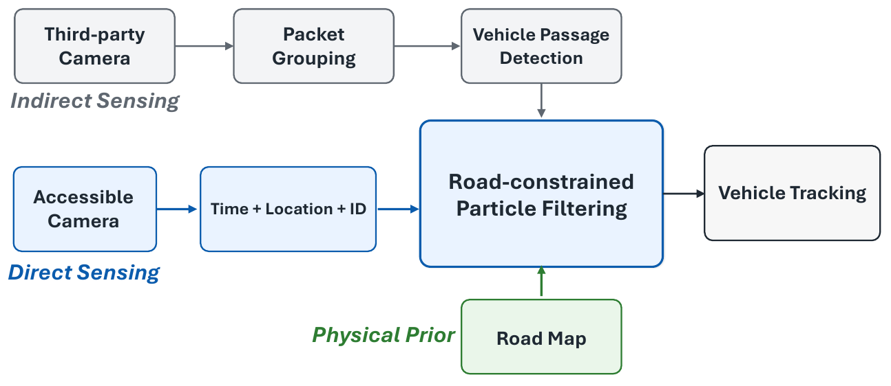

# GrayTrack

**Beyond Direct Sensing: Harnessing Indirect Observations from Third-Party Sensors in Vehicle Tracking**

Gaofeng Dong*, Vamsi Eyunni*, Pragya Sharma, Kang Yang, Mani Srivastava  
University of California, Los Angeles · *Equal contribution

[Project page](https://nesl.github.io/GrayTrack/) · [Paper (arXiv, coming soon)](https://nesl.github.io/GrayTrack/#paper) · [Citation](docs/graytrack.bib)

GrayTrack combines sparse direct observations with weak, anonymous passage events from third-party sensors using a road-constrained particle filter. A CARLA–Mininet-WiFi testbed infers these events from encrypted camera-traffic metadata.

In controlled CARLA Town05 experiments, indirect observations reduce Road-PF trajectory RMSE from **92.3 m to 36.8 m (60.1%)** and catastrophic track loss from **35.8% to 0.3%**. Passage detection achieves **0.989 F1** on 242 held-out camera sequences.

## Code

| Folder | Contents |
| --- | --- |
| [Part1-testbed](Part1-testbed/) | CARLA capture, Mininet-WiFi replay, packet grouping, and passage detection. |
| [Part2-RoadPF](Part2-RoadPF/) | Road-constrained particle filtering, tracking baselines, and evaluation. |
| [docs](docs/) | GitHub project page. |

Each part has its own setup instructions and dependencies.

